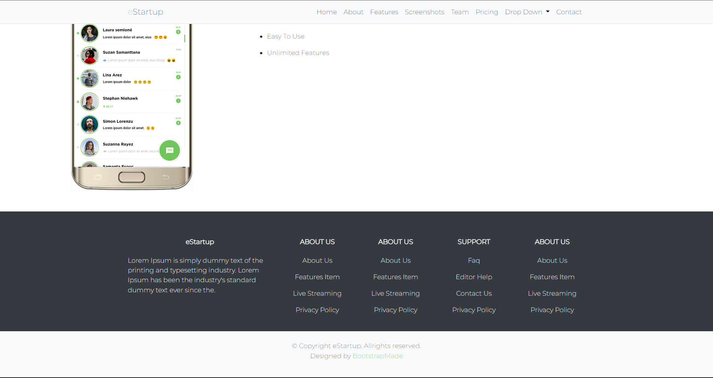

# Summary

## Bootstrap Introduction

Bootstrap is a HTML, CSS, and JavaScript framework that used to simplify the website development. In general, Bootstrap is used to implement various choices of fonts, sizes, colors, and layouts that exist in the framework into a website.

## Bootstrap Installation

There are 2 ways to import bootstrap in the project:

1. Download bootstrap through this [link](https://github.com/twbs/bootstrap/releases/download/v4.1.3/bootstrap-4.1.3-dist.zip) and import to the project.
2. For the CSS, copy this line of code into HTML project:

   ```
   <link rel="stylesheet" href="https://cdn.jsdelivr.net/npm/bootstrap@4.1.3/dist/css/bootstrap.min.css" integrity="sha384-MCw98/SFnGE8fJT3GXwEOngsV7Zt27NXFoaoApmYm81iuXoPkFOJwJ8ERdknLPMO" crossorigin="anonymous">
   ```

   For the Javascript, copy this line of code into HTML project:

   ```
   <script src="https://code.jquery.com/jquery-3.3.1.slim.min.js" integrity="sha384-q8i/X+965DzO0rT7abK41JStQIAqVgRVzpbzo5smXKp4YfRvH+8abtTE1Pi6jizo" crossorigin="anonymous"></script>
   <script src="https://cdn.jsdelivr.net/npm/popper.js@1.14.3/dist/umd/popper.min.js" integrity="sha384-ZMP7rVo3mIykV+2+9J3UJ46jBk0WLaUAdn689aCwoqbBJiSnjAK/l8WvCWPIPm49" crossorigin="anonymous"></script>
   <script src="https://cdn.jsdelivr.net/npm/bootstrap@4.1.3/dist/js/bootstrap.min.js" integrity="sha384-ChfqqxuZUCnJSK3+MXmPNIyE6ZbWh2IMqE241rYiqJxyMiZ6OW/JmZQ5stwEULTy" crossorigin="anonymous"></script>
   ```

For more details about the documentation, go through this [link](https://getbootstrap.com/docs/4.1/getting-started/introduction/).

## Simple Website Structure

Most of the websites have these simple attribute on their welcome page:

1. Navigation Bar
   - Brand a navigation bar
   - Responsive
   - Dropdown
   - Menu navigation bar
2. Main Welcome
   - Text welcome
   - Main foto
   - Link
   - Background
3. Contact Person
   - Location
   - Email
   - Phone number
   - Social media
   - Message box
4. Footer
   - copyright

# Bootstrap Practice

1.  Create a responsive header (navigation bar) like the example, that contains:

    - home
    - about
    - features
    - screenshots
    - team
    - pricing
    - dropdown
    - contact

      <p align="center">
         Result

         

      </p>

2.  Create the body of content like the example
    <p align="center">
      Body of Content 1

      
    </p>
    <p align="center">
      Body of Content 2

      
    </p>

3.  Create webpage footer like the example, that contains:

    - about us
    - support
    - copyright bar
    <p align="center">
      Welcome Page Footer
      
      

    </p>
