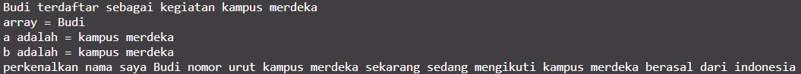
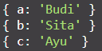
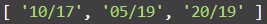
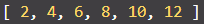
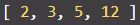

# Summary

## Introduction to JavaScript

Javascript is a high-level, scripting, untyped, and interpreted programming language. Javascript is one of the programming language that is easy to learn and understand by humans compared to Python, C++, and C.

## JavaScript Variable

In javascript, we don't need to declare the variable's datatype like in C/C++. There are 3 ways to declare a variable in JavaScript:

| Declaration    | var            | let                | const              |
| -------------- | -------------- | ------------------ | ------------------ |
| Application    | rarely used    | not-fixed variable | fixed variable     |
| Hoisted\*      | allowed        | not allowed        | not allowed        |
| Value          | can be changed | can be changed     | can not be changed |
| Initialize     | can be emptied | can be emptied     | must contain value |
| Redeclaration  | allowed        | not allowed        | not allowed        |
| Reassignment   | allowed        | allowed            | not allowed        |
| Global Scope   | allowed        | allowed            | allowed            |
| Function Scope | not allowed    | not allowed        | not allowed        |
| Block Scope    | allowed        | not allowed        | not allowed        |

Note :

\*) hoisted = can use the variable before declaring the variable

## JavaScript Method

Method is a function that related to object and make the program as simple as possible that according to its use. There are some of method in JavaScript, like:

| Method  | Function                                                                          |
| ------- | --------------------------------------------------------------------------------- |
| Concat  | combine two or more array and return its value                                    |
| Map     | create new array with the result are calling a function for each array's elements |
| Foreach | calling a function for each arrays's elements                                     |
| Slice   | choose part of the array and return it                                            |
| Filter  | create new array by filetering each element new                                   |
| Reduce  | do operation on each array's elements to be single value from left to right       |
| etc     | ...                                                                               |

## JavaScript Control Flow

Control flow used for manage the execution flow on the program statement according to the case. There are 2 ways to control flow in JavaScript:

| Control Flow                       | Application                                                       |
| ---------------------------------- | ----------------------------------------------------------------- |
| Repetition ( Looping / Iteration ) | for, while, do while                                              |
| Conditioning ( Branching )         | if ... else, switch, block, try ... catch, break, continue, throw |

# JavaScript Refreshment Practice

## 1. Recreate the JavaScript code so the output will be same as the example

    Output for Task 1:
      
    

## 2. Answer the given question

     a. Explain why line 21, 22, 23 cannot be displayed?

    Answer: The function will run if the value of "terdaftar" assigned as true. So, line 21, 22, 23 cannot be displayed because the value of "terdaftar" assigned as false ( on line 4 ).

    b. Explain why declaration on line 26 cause an error?

    Answer: Declaration on line 26 cause error because "nama" declared with const, which cannot be changed.

    c. By commenting on line 26, is line 28 can be executed? explain it.

    Answer: By commenting on line 26, line 28 still cannot be executed. Its because of "asal" is declared inside of "perkenalan" function, which is not globally accessible.

## 3. Destructuring the JavaScript code

    Store "Budi" in variable a
    Store "Sita" in variable b
    Store "Ayu" in variable c

    Output for Task 3:
      
    

## 4. Change the (-) symbol into (/) symbol for each element on the array

    Output for Task 4:
      
    

## 5. Multiply each of element on array (named as "value") by 2

    Output for Task 5:
      
    

## 6. Round each value on array (arr)

    Output for Task 6:
      
    

