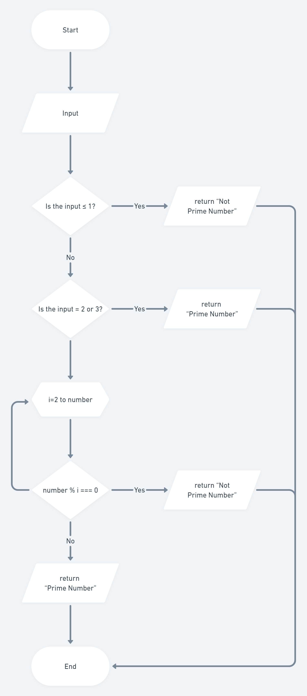
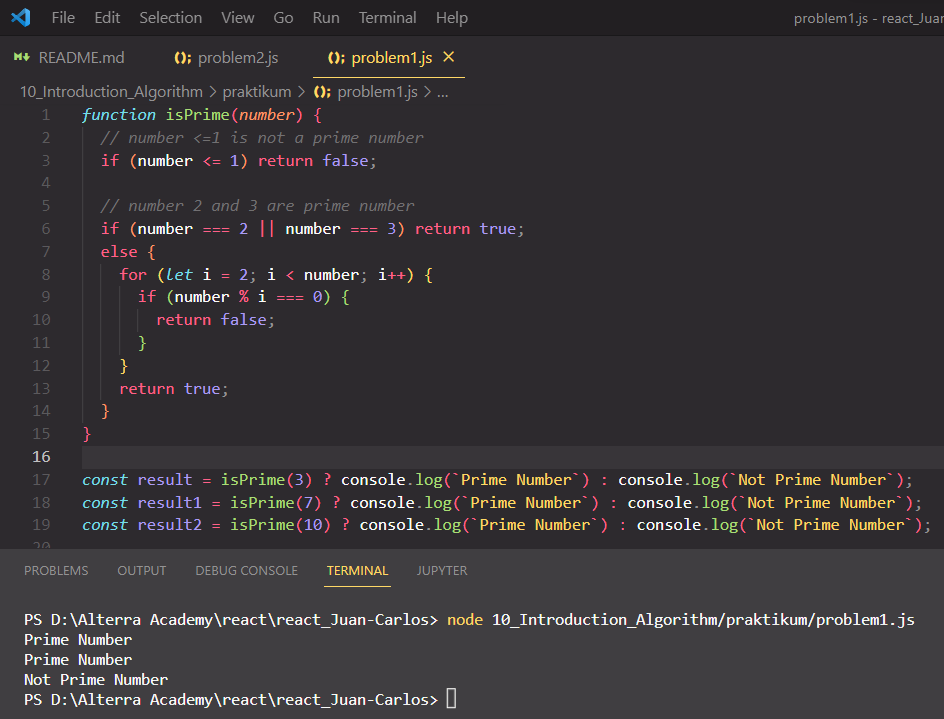
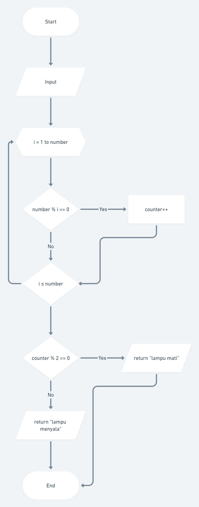
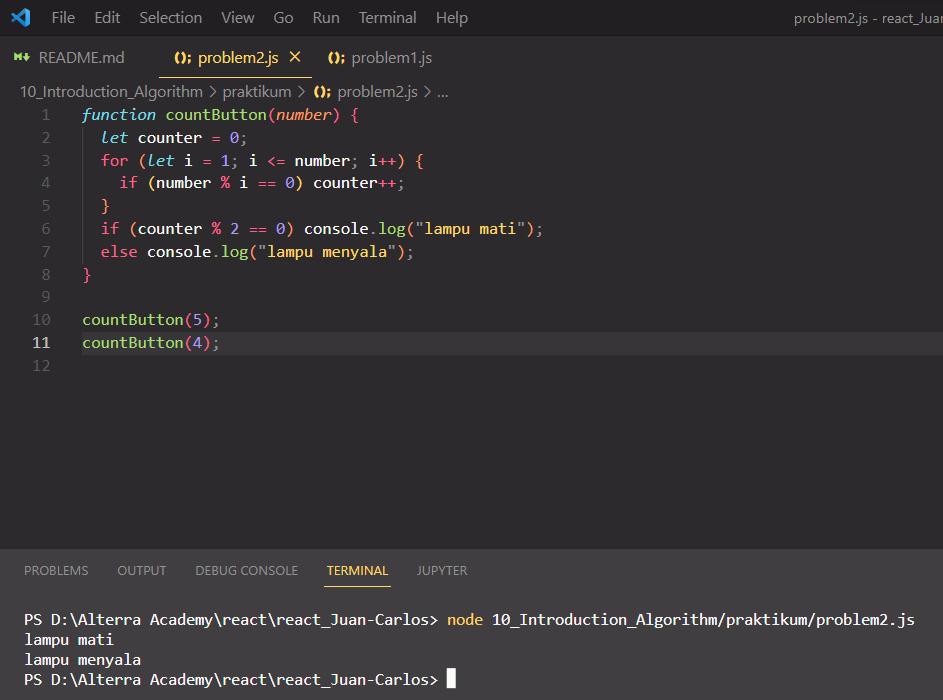

# Summary

## Introduction Algorithm

Algorithm is a well-defined computation procedure that take some value as the input and then generate some value as the output. The example of algorithm are to check prime number, sorting, searching, etc.

## Algorithm's Characteristic

The characteristic of algorithm are:

- Have limitation (begin and end)
- Well-defined instructions
- Effective and efficient

Basic algorithm concept:

- Sequential
- Branching
- Looping

## Flowchart

Flowchart is a chart with specific symbol that represent the sequence and relation between processes in detailed.

    Flowchart Symbol and Its Function
      
    

# Introduction Algorithm Practice

## 1. Is Prime Number

Given a number, the program needs to determine is the number prime or not.

    Flow Chart for Problem 1:
      
    

    Output for Problem 1:
      
    

## 2. Light and Button

There are N buttons from 1 to N and a light with off state. If button-i pressed, the light's state will changes (from off => on || from on => off) if N is divisible by i. If each button is pressed exactly once, what will the light's state be in the end?

    Flow Chart for Problem 2:
      
    

    Output for Problem 2:
      
    

