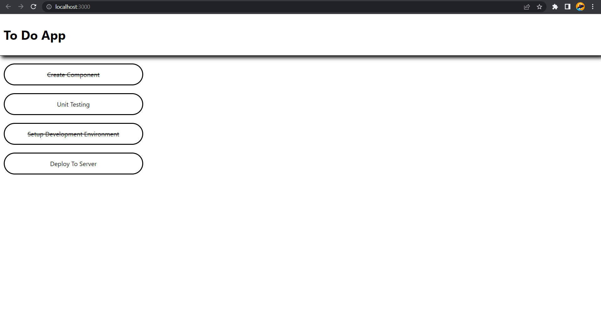

# Summary

## JSX (JavaScript XML)

JSX is a React extension to the JavaScript language syntax which provides a way to structure component rendering using syntax familiar to many developers. By using JSX, we can combine HTML, CSS, and JavaScript only in one page. For example:

```
<MyButton color="blue" shadowSize={2}>
    Click Me
</MyButton>
```

## React Component

React component are parts of code that can reuseable and have a function to decide the interface, behavior, and state in UI. There are function and class component in React. Below is the difference between function and class component.

Function component:

```
function Welcome() {
    return <h1>Hello, World!</h1>;
}
```

Class component:

```
class Welcome extends React.Component {
    render() {
        return <h1>Hemmlo, World!</h1>;
    }
}
```

## Component Composition & Props

Props (abbreviation of properties) has function to allow us give argument / data on component. Besides that, props help us to make component more dynamic. In real case, props pass to component same like giving attributes on tag HTML. The characteristics of props are read-only and can't be changed.

Component composition divided by 2:

- Containment
- Specialization

## React Lifecycle

General lifecycle method in React:

1. render()

   - It is the pure function, means that setState() can't be exist.
   - render() is required on class component.

2. componentDidMount()

   - Call when the component are rendered for the first time
   - The right place to call API
   - setState() allowed

3. componentDidUpdate()

   - Call when there is an update (props / state changed)

4. componentWillUnmount()

   - Call when we want to terminate the component
   - Suitable for clean-up actions

## Conditional Render

We can make different components on React to perform actions needed. Then, just render only a few part based on the state in our application by using:

- if
- inline if with && operator
- Inline if-else with ternary conditional operator
- Prevent the component from rendering

## Render List

We can build collection from some element and attach them in JSX using curly braces. For example:

```
const numbers = [1, 2, 3, 4, 5];
const listItems = numbers.map((number) =>
    <li>{number}</li>
);

ReactDOM.render(
    <ul>{listItems}</ul>,
    document.getElementById('root')
);
```

When rendering list, we need the key. Key helps React to identify which items have been changed, added, or removed.

## React Structure Directory

React doesn't have convention about how to input the file into folder. But, to make it clear, we can avoid too much nesting and group them by:

- Feature or Route
- Kinds of File

## React Styling

On React, we have 3 ways to style our website. They are:

1. Classes and CSS
2. Style Attribute
3. CSS Module

# React Fundamental Practice

Build "To Do List" application using React. The list have 3 field: id (number), name (string), and completed (boolean). If completed = true, to do activity will crossed out.

<p align="center">
    Home Page:
    <br><br>
    
</p>
