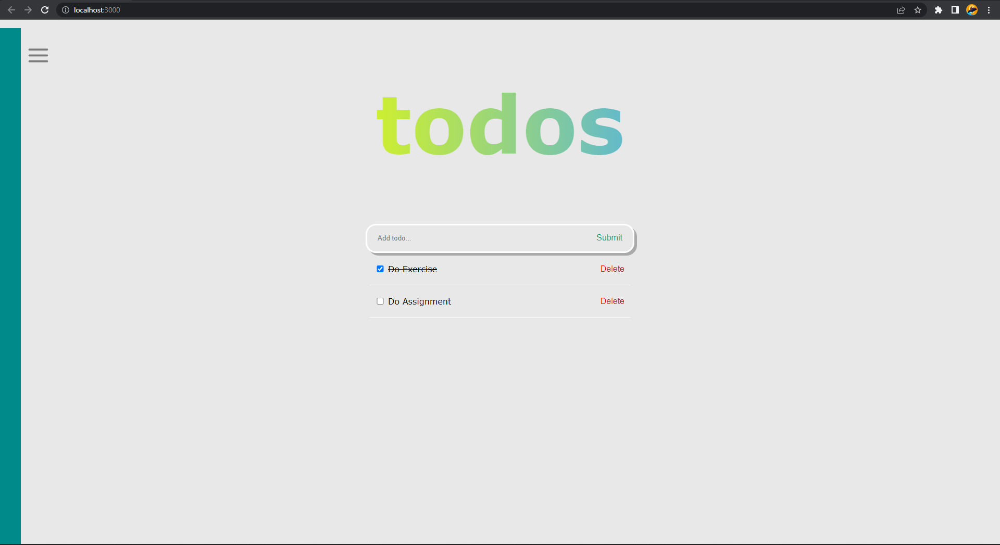
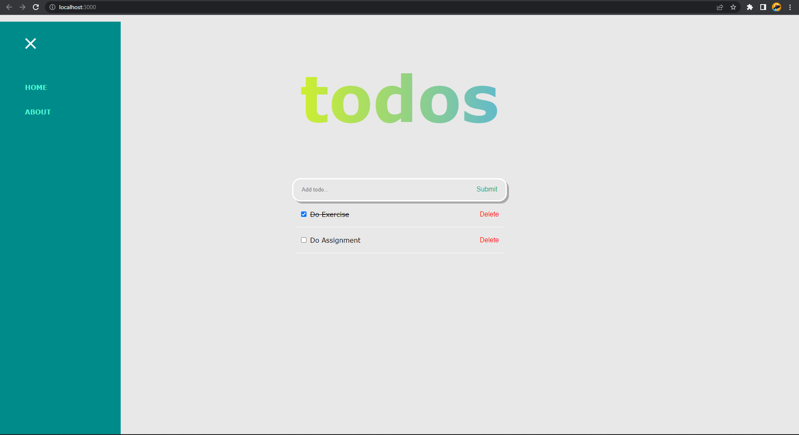
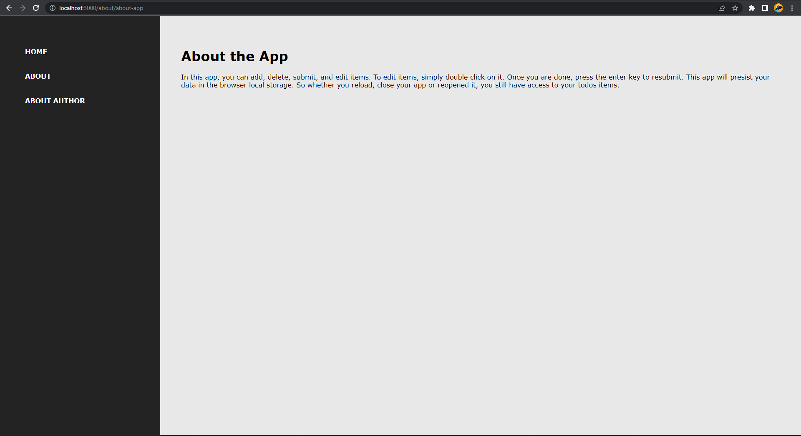
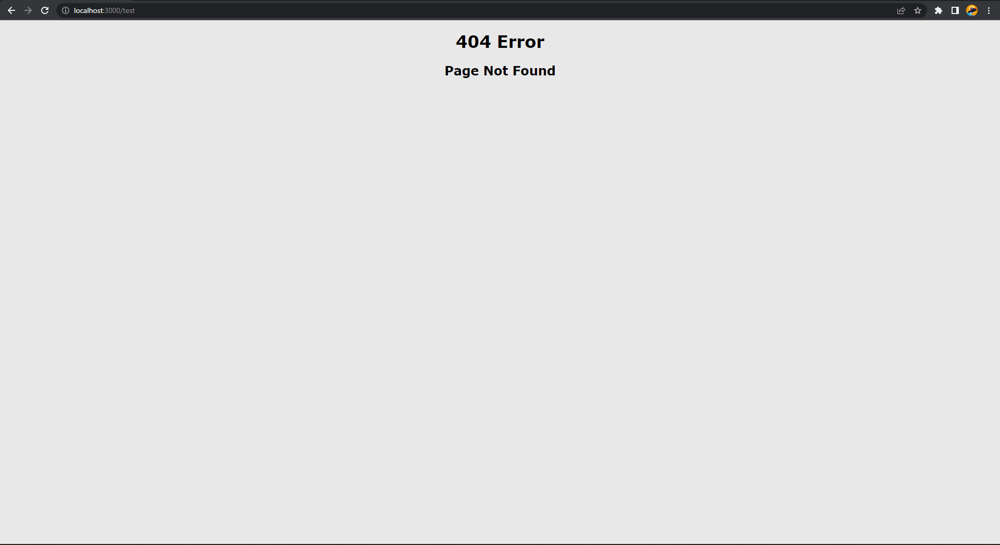

# Summary

## React Router

Router is a module in React that functions to navigate processes in SPA (Single Page Application).

- Single Page Application (SPA) is one kind of website application which only has 1 page to handle all activities in the application.
- Multi Page Application (MPA) also called traditional web app is kind of web application that needs to re-render all the web pages every time after the user create a new request.

Basic guide to routing in react by using React Router:

1. BrowserRouter

   BrowserRouter is used as a router that uses the history API from HTML5, so it can use location to sync UI with URL. In the location of the object itself, it represents where the application is now located.

2. Route

   Route is used to direct the traffic of a web application. **Path** attribute is the url in the browser on routing process. **Component** attribute is a component that will be displayed to the user when accesing the defined path.

3. Switch

   Switch is used to wrap some group of **Route** component. **Exact** ensures that the route only re-renders components that have a matching path. If nothing matches, then the root that will be rendered is the last route with component _Notfound_.

4. Link

   Link is used to switch between pages, the **to** property in link is refers to the path in the route to be addressed.

## URL Param in React

URL Parameter is a parameter whose value is set dynamically in the page URL. We used `this.props.match.params` to apply URL param in React.

The differences between Link and Redirect:

| Link                               | Redirect                     |
| ---------------------------------- | ---------------------------- |
| Use in all condition               | More often use in 404 page   |
| Add new history on browser         | Overwrite history on browser |
| Reaction by clicking like `a href` | Reaction with a condition    |

## Hook Routing in React

General hook routing in React are:

1. useHistory

   useHistory gives us access to history instance that can used to navigating. For example:

   - length => number of entries in history stack
   - go => move the indicator in history stack as many as n entries
   - goBack => same as go(-1)
   - goForward => same as go(1)
   - push => push new entry to history stack
   - replace => replace current entry in history stack
   - etc.

2. useParams

   Return couple of key/value parameter URL objects. It can used to access match.params from current `<Route>`.

3. useRouteMatch

   useRouteMatch try to match current URL in the same way as `<Route>`. This is mostly useful for getting access to match data without actually rendering `<Route>`.

# React Routing Practice

Continue "To Do List App" on React Hook section by adding:

1. Create navbar using link, home with path: "/" and about with path "/about".
2. For page about, create new navbar contains of About App with path: "/about/about-app" and About Author with path: "/about/about-author".
3. If the entered path not found in the route, show page not found.
4. If the link leads to the same page, add replace or redirect so the browser history is not added (optional, plus value).
5. Free design for icon and navbar layout but the concept should be the same.

Task Result:

    Homepage (NavBar is Hidden):
      
    

    Homepage (NavBar is Shown):
      
    

    About-App:
      
    

    About-Author:
      
    

If the entered path not found in the route, **Page Not Found** will be displayed. After 2 seconds, the page will redirect to the Homepage.

    Page Not Found:
      
    

