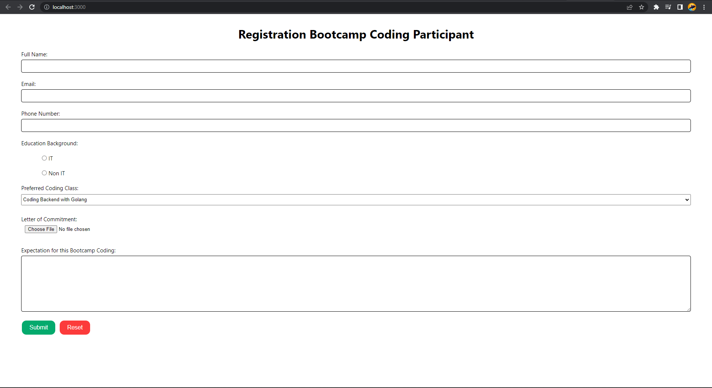
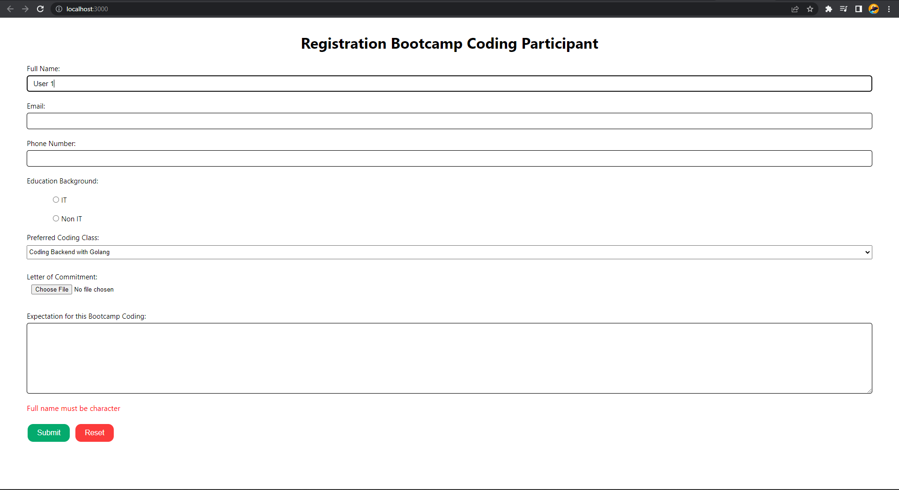
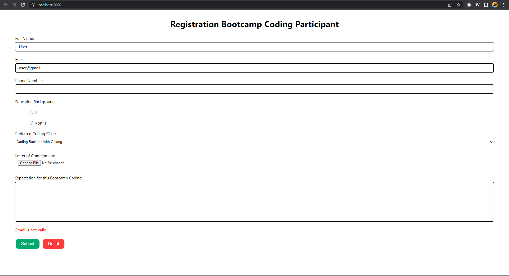
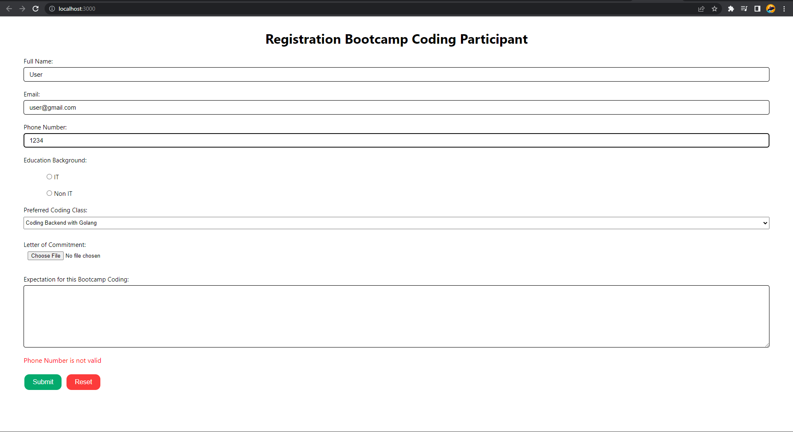
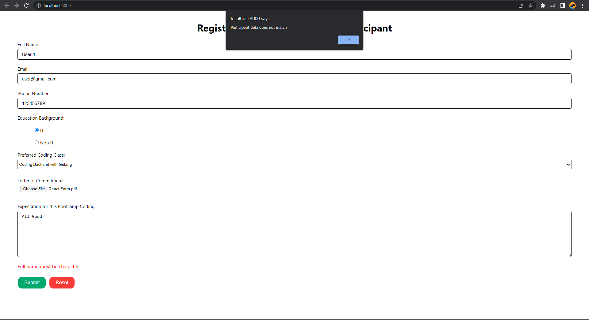
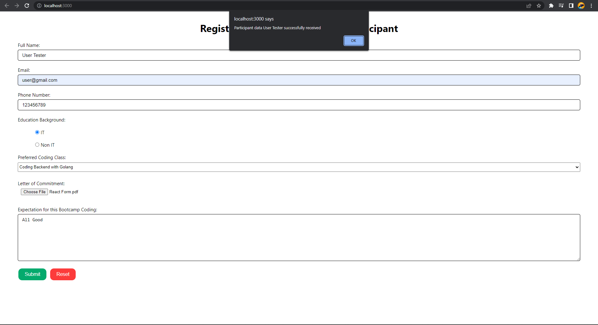

# Summary

## Basic Form

Form used to handle the input from the user. There are many kinds of form, for examples:

1.  Element `<input>` => Used for short input

2.  Element `<textarea>` => Used for long input

3.  Element `<select>` => User can select the input from the given options

4.  Radio Button `<input type="radio"/>` => User only can choose one option to be the input

5.  Checkbox `<input type="checkbox"/>` => User can choose more than one options to be the input

6.  etc...

## Uncontrolled vs Controlled Component

Uncontrolled component have uncontrollable input like form input in traditional HTML. In this component, we can add the value using ref. For example, we add onClick handler on the button. But, uncontrolled input not powerful like controlled input.

Controlled component have controllable input. A controllable input receive the current value as props and callback to change the value. So, to save the current value and update it we can use state in React. We can store it in another component state or in separate state store like Redux.

The table below shows the controlled input element, value property, change callback, and new value in callback:

| Element                     | Value Property       | Change Callback | New Value in Callback |
| --------------------------- | -------------------- | --------------- | --------------------- |
| `<input type="text" />`     | value="string"       | onChange        | event.target.value    |
| `<input type="checkbox" />` | checked={boolean}    | onChange        | event.target.checked  |
| `<input type="radio" />`    | checked={boolean}    | onChange        | event.target.checked  |
| `<textarea />`              | value="string"       | onChange        | event.target.value    |
| `<select />`                | value="option value" | onChange        | event.target.value    |

Below is comparison table between uncontrolled and controlled component

| Features                                  | Uncontrolled | Controlled |
| ----------------------------------------- | ------------ | ---------- |
| one-time calue retrieval (e.g. on submit) | O            | O          |
| validating on submit                      | O            | O          |
| instant field validation                  | X            | O          |
| conditionally disabling submit button     | X            | O          |
| enforcing input format                    | X            | O          |
| several inputs for one piece of data      | X            | O          |
| dynamic inputs                            | X            | O          |

## Basic Validation

We need to validate the form input before entering the system database. For examples, input name only receive **character**, input phone number only receive **number**, etc. There are some built-in form validation in HTML5:

1. `required` => used to specify the field form that require an input before the form is submitted

2. `minLength` and `maxLength` => used to determine the minimum and maximum numbers of character as the input

3. `min` and `max` => used to determine the minimum and maximum number as the input

4. type => used to specify the input data type like number, email, or another data type

5. pattern => used to determine regular expression (regex) that define the data pattern as the input of the form.

If we use the built-in form validation from HTML5, we can not change the error message because it's already set. As the alternative, we can use logic in JavaScript to validate the data input and edit the error message if it not validated.

# React Form Practice

Create Registration Form for Bootcamp Coding with criterias:

1. Field "Full Name" is mandatory and only receive alphabed
2. Field "Email" is mandatory and receive a valid email
3. Field "Phone Number" is mandatory and in range 9-14 character
4. Field "Education Background" is mandatory with radio type
5. Field "Preffered Coding Class" is mandatory with option:
   - Coding Backend with Golang
   - Coding Frontend with ReactJS
   - Fullstack Developer
6. Field "Letter of Statement" is mandatory and receive a file
7. Field "Expectation for this Bootcamp Coding" is optional
8. Button "Submit" is mandatory and has function to submit and reset the form
9. Button "Reset" is not mandatory and has function to reset the form and error message.

Task Result:

    Registration Bootcamp Coding Participant Form
      
    

    Error: full name must be character
      
    

    Error: email is not valid
      
    

    Error: phone number is not valid
      
    

    Registration Failed Alert: Participant data does not match
      
    

    Registration Succeed Alert: Participant data (fullName) successfully received
      
    

