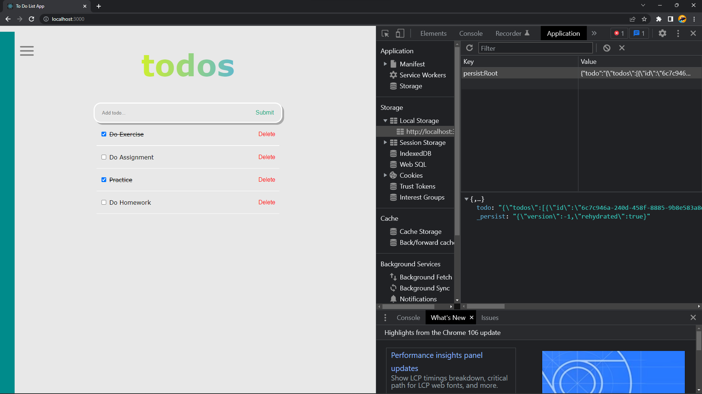

# Summary

## Global State Management

Global state management means we manage the data across multiple components. Global state is necessary when we want to get and update data anywhere in our app, or in multiple components at least. One of the library and popular to manage global state is Redux. Redux applied "one-way data flow" structure on the application/website. Perfect time to use redux are when:

1. Many state to use in many place
2. The state of the app changes frequently
3. Complexity logic to create state
4. Medium until large size of codebase and done by many person
5. Need to know how state being updated along with the time.

Redux Libraries and Tools:

- React-Redux
- Redux Toolkit
- Redux DevTools Extension

Important component in Redux:

- Actions => used to give information from application to store
- Reducer => pure JavaScript function that takes current state and object action then return new application state.
- Store => central object that store the state of the application.

There are 2 method to use and change state in Redux:

1. Hooks
2. Connect

## Data Fetching

Data fetching is the process when application request the data from server, then the server response to the application by sending the data. There are 3 popular method to do data fetching in React:

1. Fetch API
2. Axios
3. React Query Library

There are some fields when we use Fetch API to fetch the data:

- method - GET, POST, PUT, DELETE, HEAD
- url - URL from request
- body - body from request
- headers - object headers
- referrer - referrer from request
- mode - cors, no-cors, same-origin
- credential - omit, same-origin
- redirect - follow, error, manual
- integrity - subresource integrity value
- cache - cache mode (default, reload)

## Hasura

The Hasura GraphQL Engine is a blazing-fast GraphQL server that gives you instant, realtime GraphQL APIs over Postgres, with webhook triggers on database events, and remote schemas for business logic. Before using the Hasura GraphQL Engine, we need to:

1. Deploy the Hasura GraphQL engine, with access to a Postgres database to store its metadata.
2. Connect new/existing database(s) and set up and test your GraphQL API using the Hasura console UI (also possible via CLI or API).
3. Consume the generated GraphQL API from your client apps.

To create REST API:

- Create => http://{baseurl}/api/rest/article
- Read => http://{baseurl}/api/rest/article
- Update => http://{baseurl}/api/rest/article{id}
- Delete => http://{baseurl}/api/rest/article{id}

# Global State Management Practice

Apply redux and redux-persist to "To Do List" App.

Task Result:

    Redux-persist with name "Root" store the data into google chrome local storage.
      
    
    

