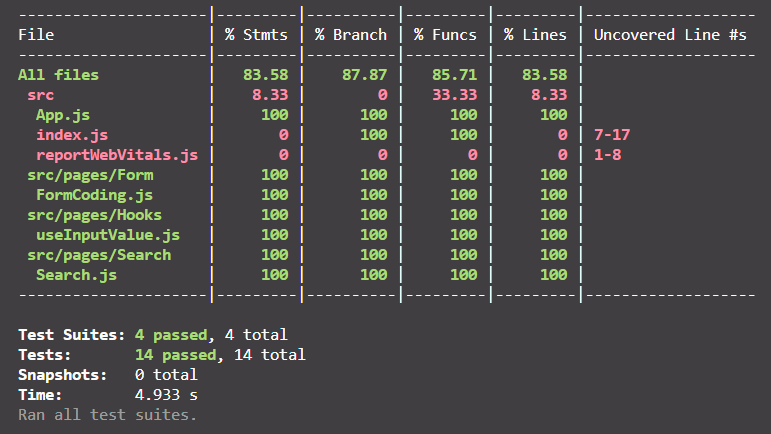

# Summary

## Testing Introduction

Testing is the process of verifying that our test assertions are correct and that our code remains true throughout the lifetime of the application. Test assertion is a boolean expression that will return true value except there is a bug in our code. There are 2 categories to do testing in React:

1. Rendering component trees.
2. Running the full version of application.

Tools that recommend to do testing in React are **Jest** and **React Testing Library**. If the project installed by `create-react-app`, Jest and React Testing Library are installed by default.

## Create Basic Testing with RTL

The function of **render** RTL is to render all required JSX files. To make sure that our JSX files are rendered, we can use **debug** RTL function. Always use debug RTL function if we don't know what the result from render RTL function.

React Testing Library offers many functions to get element. That are:

1. **getByText** to select text from the selected element.
2. LabelText: **getByLabelText**: `<label for"search" />`.
3. Placeholder Text: **getByPlaceholderText**: `<input placeholder="Search" />`.
4. AltText: **getByAltText**: `<image alt="profile" />`.
5. DisplayValue: **getByDisplayValue**: `<input value="JavaScript" />`.
6. etc.

## Handle Testing

There are 3 categories of handel testing in React:

1. Handle event

   Basic testing that use basic function to get element.

2. Handle asynchronous

   It used when try to fetch API, in this case we need to create mock API for **axios**. Then, we need to create mock promise when the results are resolve or reject. It depends on our scenario.

3. Testing custom hook

   To test custom hook, we use **React Hooks Testing Library**. It gives us the tools to testing hooks without rendering one component. Below is the syntax to install it:

   ```
   npm install -D @testing-library/react-hooks
   ```

   We can perform tests on the value, callback, and re-render of the custom hooks. Access this [link](https://react-hooks-testing-library.com/) to check full documentation of React Hooks Testing Library.

# React Testing Practice

Create testing file for the codes:

- FormCoding.js
- Search.js
- useInputValue.js

Task Result:

<p align="center">
    <br>
    
</p>
