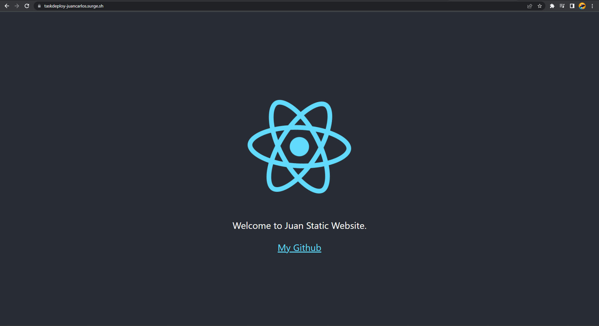
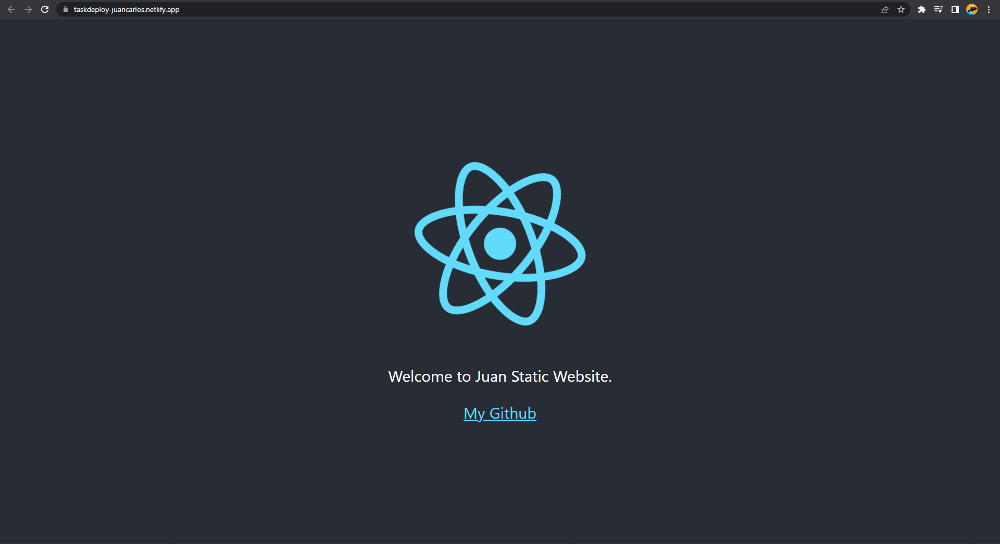

# Summary

## Build React Application

By default, React have many alert messages. These alerts are very helpful for the development version of the application. But, these alerts messages make React application bigger and slow in performance. So, we need to build the app to production version when we want to deploy the application. **Build** React application make our application to production version, so the performance is lighter and faster.

To build our React application to production version, we create new folder named "./build" by using:

```
npm run build
```

To run optimized app in our local computer, we can use **serve**

```
// install serve
npm install -g serve

// run serve in local
serve -s build
```

## Deployment with Surge

Deployment is an activity that aims to share applications that we make. Hopefully the application can be accessed by many people, not only for ourselves.

Surge is a free static website publisher service for Front-End Developers. Static website that use surge will have \*.surge.sh as the subdomain. Surge accept HTML, CSS, and JS.

To install Surge in terminal, run:

```
npm install --global surge
```

After that, to deploy the application using Surge, run `surge` in terminal. Sometimes, we don't want to publish partial domain or subdomain. For that, we can teardown that project using Surge CLI by:

```
surge teardown example.surge.sh
```

## Deployment with Netlify CLI

Netlify is a platform that serves build tools services and Continous Deployment. Netlify allow us to publish static website for free. Netlify is also integrated with popular Git Hosts like Github, Gitlab, and Bitbucket.

To install Netlify CLI in terminal, run:

```
npm install netlify-cli -g
```

Deploy our application by running:

```
netlify deploy
```

Verify your account in browser by select **Authorize**. Then in terminal, select "**Create & configure a new site**". For the file location that we want to deploy, select "./build" folder.

## Deployment Practice

Deploy code create react project that slightly modified using Surge/Netlify. Deployed link have format "**taskdeploy-yourname**". The main component of the task mark is the deployment, not the user interface or design of create react project that slightly modified.

Task Result:

<p align="center">
    Link deployment to Surge: <a href="https://taskdeploy-juancarlos.surge.sh/">https://taskdeploy-juancarlos.surge.sh/</a>
    <br><br>
    
</p>

<p align="center">
    Link deployment to Netlify: <a href="https://taskdeploy-juancarlos.netlify.app/">https://taskdeploy-juancarlos.netlify.app/</a>
    <br><br>
    
</p>
