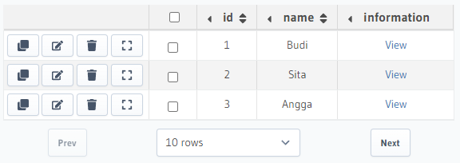
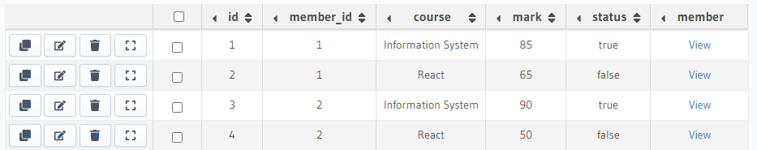
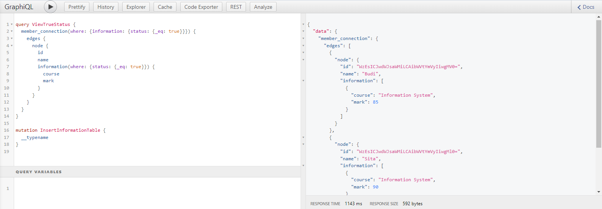
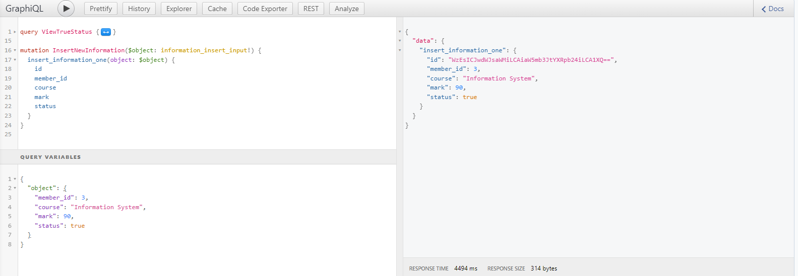
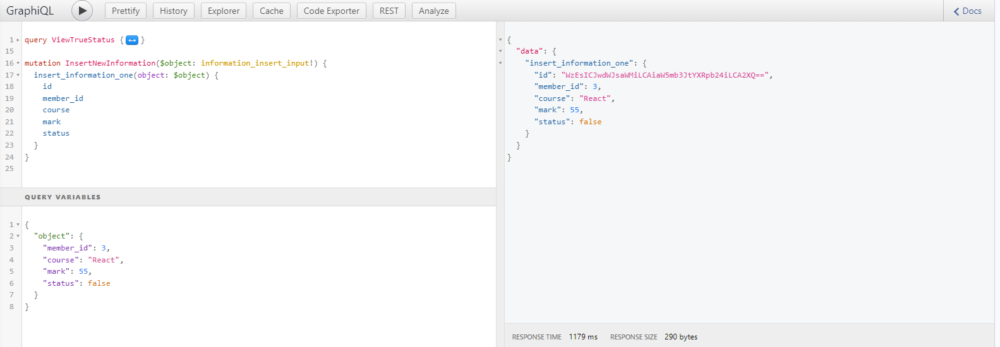
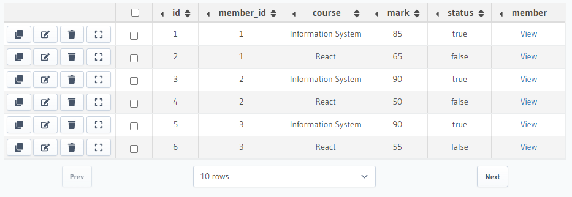
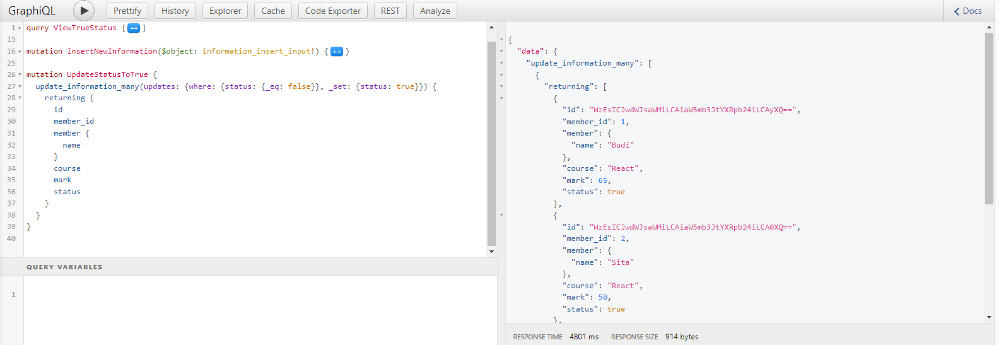
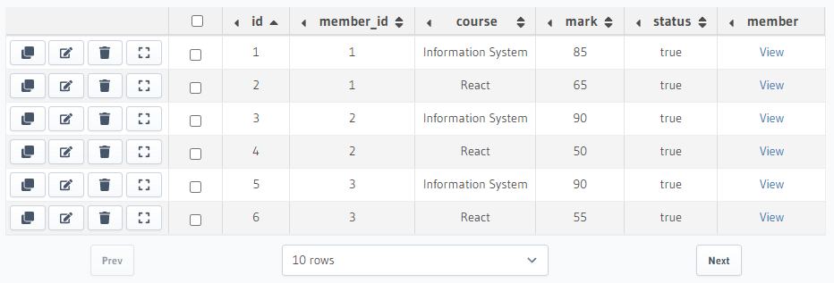

# Summary

## GraphQL

GraphQL is a query language for API, and a server-side runtime for executing queries by using a type system that define for data. GraphQL minimizes the amount of data needs to be transferred over the network. With graphQL, we can use one single endpoint (/graphQL) for any requests needed.

Before do graphQL, we need to setup graphQL Server (Backend) using Hasura, Apollo Server, or others to do that. After that, we can use graphQL on client either using Prisma, Apollo Client, Postman, etc.

There are 3 main Features in graphQL client:

1. Query

   Get data based on spesific queries that are defined.

2. Mutation

   Insert, update, and delete data.

3. Subscription

   Get updated date realtime/based on events.

## Query

With graphQL we can get data exactly according to our needs. We define what fields that we want to get and graphQL will give us data based on what we define. For example, imagine there is one collection in database that holds movies data. All unneeded data like director, created_at, and updated_at can will not be included in the result.

Implementation:

```
// REST
[{
    id: 1,
    title: "Batman",
    year: "2020",
    director: {
        id: 3,
    },
    created_at: "2020-12-22T03:16:09.000Z",
    updated_at: "2020-12-23T14:22:20.000Z",
}]

// GraphQL Query
{
    query{
        movies{
            id
            title
        }
    }
}
```

Then the results of graphQL query above are:

```
{
    movies:[{
        id: 1,
        title: "Batman",
    }]
}
```

**GraphQL Fragment** is a piece of logic that can be shared between multiple queries and mutations. We can use fragment to simplify query or mutation. For example:

```
// GraphQL Query
fragment FR_Movie on movie {
    id
    title
}

{
    query{
        movies{
            ...FR_Movie
            director{
                name
                age
            }
        }
    }
}
```

Then the result will be:

```
// GraphQL Result
{
    movies:[{
        id: 1,
        title: "Batman",
        director:{
            name:"Nolan",
            age: 51,
        }
    }]
}
```

## Hasura and Heroku

Hasura is a service provide graphQL and rest API. Fully managed on hasura cloud or self-hosted. Go through this [link](https://hasura.io/) and create new graphQL server.

Heroku is a cloud platform as a service supporting several programming languages. Heroku also provide free postgres database. Go through this [link](https://heroku.com/) and create service.

# GraphQL Basic Practice

Workflow task:

1.  Open hasura and create database with name kampus_merdeka (I use neon database).

2.  Create member table that contains id (primary key, auto increment) and name.

3.  Create information table that contains id (primary key, auto increment), member_id, course, mark, and status (boolean).

4.  Insert these datas to member table:

    | id  | name  |
    | --- | ----- |
    | 1   | Budi  |
    | 1   | Sita  |
    | 3   | Angga |

     <p align="center">
         Member Table
        <br><br>
        
     </p>

5.  Insert these datas to information table:

    | id  | member_id | course             | mark | status |
    | --- | --------- | ------------------ | ---- | ------ |
    | 1   | 1         | Information System | 85   | true   |
    | 2   | 1         | React              | 65   | false  |
    | 3   | 2         | Information System | 90   | true   |
    | 4   | 2         | React              | 50   | false  |

    <p align="center">
        Information Table
        <br><br>
        
     </p>

6.  Create a query to view only members that have true status.

       <p align="center">
        

    </p>

7.  Insert the below information about Angga on information table using mutation query.

    | id  | member_id | course             | mark | status |
    | --- | --------- | ------------------ | ---- | ------ |
    | 5   | 3         | Information System | 90   | true   |
    | 6   | 3         | React              | 55   | false  |

    <p align="center">
        Insert Information System course to Angga
        <br><br>
        
     </p>
     <p align="center">
        Insert React course to Angga
        <br><br>
        
     </p>

    Below is the information table after add information about Angga course, mark, and status:
     <p align="center">
        
     </p>

8.  Update false status into true using mutation query.

    <p align="center">
        
     </p>

    Below is the information table after updated false status into true:
     <p align="center">
        
     </p>
