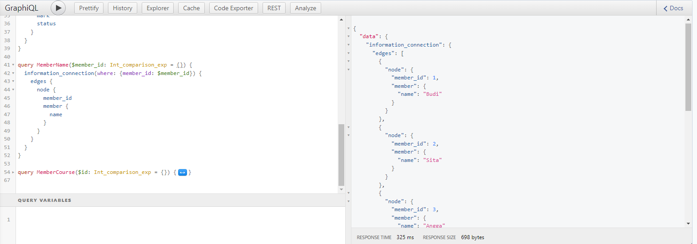
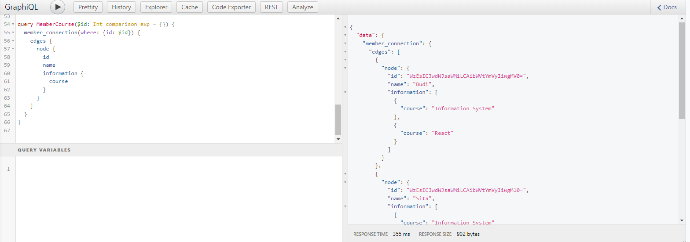

# Summary

## Database

Database is an organized data set. In the database, there is data model to set the model of its data. For example, in twitter there is account model for each account. Account model can be visualized on the table with name account table.

| Account      |
| ------------ |
| Display Name |
| Username     |
| Bio          |
| Location     |
| Join Date    |

For instance Roger Rodrigo, who lived in United States, has a twitter account with username @roger_rodrigo007. He write "Be steady like a rock" on his bio. He joined twitter on 27 August 2020. So, twitter model his account on the database like the table below.

| Account #1            |
| --------------------- |
| Roger Rodrigo         |
| @roger_rodrigo007     |
| Be steady like a rock |
| United States         |
| 27/08/2020            |

## Database Relationship

There are 3 general database relationship:

1. One-to-One

   Relationships of one parent data only have one child data and one child data only can have one parent data.

2. One-to-many

   Relationships that are very often used in making a database, especially on data that has a number of children or branches and there is one parent data.

3. Many-to-many

   Relationships of one parent data can have one or many child datas and one child data can have one or many parent datas.

## Relational Database Management System

The software used to store, manage, query, and retrieve data stored in a relational database is called a Relational Database Management System (RDBMS). The RDBMS provides an interface between users and applications and the database, as well as administrative functions for managing data storage, access, and performance. One of the software that implement **Relational Database Model** is MySQL.

There are 3 type of command in SQL:

1. DDL (Data Definition Language)
2. DML(Data Manipulation Language)
3. DCL (Data Control Language)

# Relational Database Practice

Using database kampus_merdeka, do these tasks:

1.  Create one-to-one database relationship, where **member_id** on information table connect to **name** on member table.

    It will return member's name on the member table according to the member_id on information table.
    

    
    

2.  Create one-to-many database relationship, where **id** on member table connect to **course** on information table.

    It will return courses the member took on the information table according to the id on member table.
    

    
    

