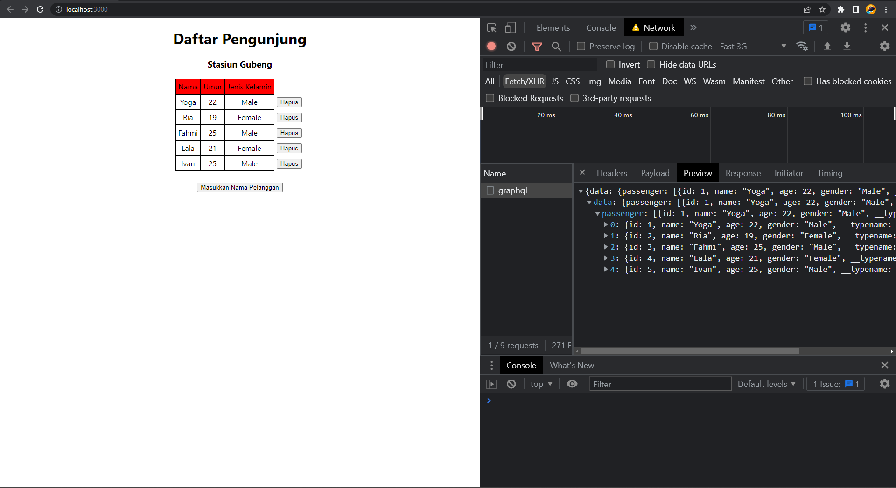
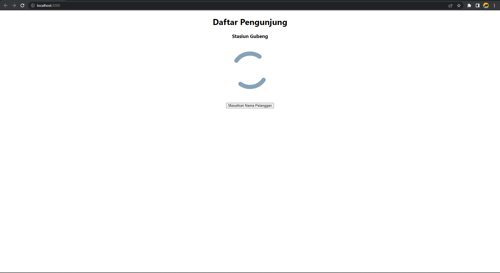
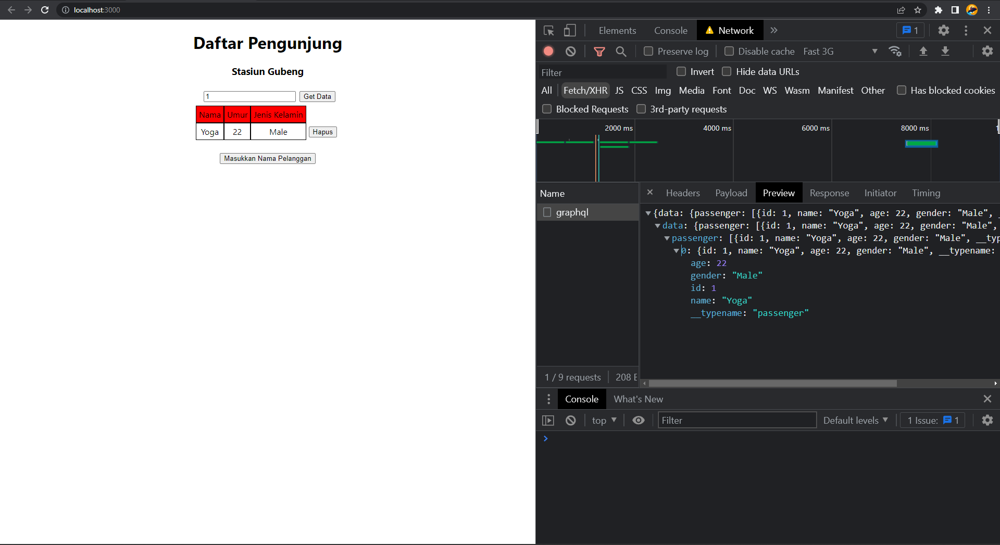

# Summary

## Apollo Setup

Apollo client is a comprehensive state management library for JavaScript that enables us to manage both local and remote data with GraphQL. WE can use it to fetch, cache, and modify application data, all while automatically updating UI. The core `@apollo/client` library provides built-in integration with React. We can use Apollo client to do any GraphQL operations (such as query, mutation, and subscription) inside our React or NextJS application. Apollo client works well with any GraphQL server like Hasura, Apollo Server, etc.

Apollo client NextJS setup installation:

1. Create new ReactJS project

   ```
   npx create-react-app react-graphql
   ```

2. Install GraphQL and apollo client

   ```
   yarn add graphql @apollo/client
   ```

3. Go to src folder (`npm i @apollo/client`) and (`npm i graphql`)
4. Create apollo-client.js inside src folder
5. Create ApolloClient and export
6. Setting apollo provider, in index.js import ApolloProvider and apollo-client. For furthermore details, read the documentation through this [link](https://www.apollographql.com/docs/react/get-started/).

## Query

We can do query on GraphQL project by:

1. Import gql and useQuery then write your query, or you can copy from hasura console instead.

   ```js
   import { gql, useQuery } from "@apollo/client";

   const GetTodolist = gql`
     query MyQuery {
       todolist {
         is_done
         id
         title
       }
     }
   `;
   ```

2. Get initial data by doing query on the server, call useQuery in top of your code

   ```js
   const { data, loading, error } = useQuery(GetTodolist);
   ```

   - data

     An object containing the result of your GraphQL query after it completes.

   - error

     If the query produces one or more errors, this object contains array of errors.

   - loading

     If `true`, the query is still in flight and results have not yet been returned.

3. Consume data in your jsx code, note that in first request data is null so need use optional chaining to avoid error.

## Lazy Query

When React renders a component that calls `useQuery`, Apollo Client automatically executes the corresponding query. But what if we want to execute a query in response to a different event, such as a user clicking a button?

The `useLazyQuery` hook can use to execute queries in response to events besides component rendering. Unlike with useQuery, when we call useLazyQuery, it does not immedietely execute its associated query. Instead, it returns a query function in its result tuple that we call whenever we are ready to exectue the query.

```js
import { useLazyQuery } from "@apollo/client";

function TodoList() {
  const [getTodo, { data, loading, error }] = useLazyQUery(GetTodo);

  const onClickGetData = () {
    getTodo();
  }
}
```

Refetch enables us to refresh query results in response to a particular user action, as opposed to using a fixed interval. We can optionally provide a ner variables object to the refetch function. If we don't, the query uses the same variables that it used in its previous execution.

```js
import { useLazyQuery } from "@apollo/client";

function TodoList() {
  const [getTodo, { data, loading, error, refetch }] = useLazyQUery(GetTodo);

  const onClickRefetchData = () {
    refetch();
  }
}
```

# GraphQL Query and Apollo Client Practice

1. Connect [this](https://github.com/muhammad-muchson/GrapQL_Query_task_starter.git) react project to GraphQL.
2. Do a query to your database so when the page is rendered, it shows the passenger list after fetching it from the database.

   <p align="center">
   
   </p>

   The screen will shows animated loading when the system is fetching the data from database.

   <p align="center">
   
   </p>

3. Create a new feature to view passenger data by using query. It has a function for user to search the passenger data according to passenger id.

   <p align="center">
   
   </p>
