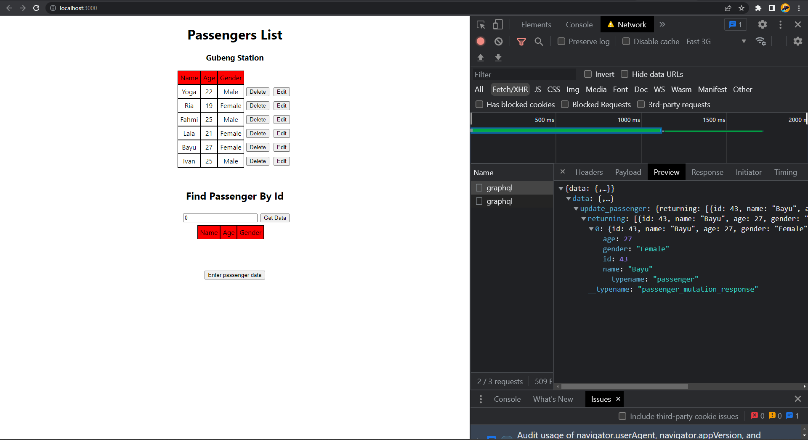

# Summary

## Mutation Insert Data with Apollo Client

1. Import useMutation hooks from apollo client and define mutation.

   ```js
   import { gql, useMutation } from "@apollo/client";

   const InsertTodo = gql`
      <!-- gql goes here -->
   `;
   ```

2. Invoke useMutation and using array destruction define mutation handler (insert Todo) and use it.

   ```js
   const [insertTodo, { loading: loadingInsert }] = useMutation(InsertTodo, {
     refetchQueries: [GetTodolist],
   });
   ```

   `refetchQueries`: an array (or a function that returns an array) that specifies which queries you want to refetch after the mutation occurs.

3. Call insertTodo query with variables.

   ```js
   insertTodo({
     variables: {
       object: {
         title: title,
         user_id: 1,
       },
     },
   });
   ```

## Mutation Update Data with Apollo Client

1. Import useMutation hooks from apollo client and define mutation.

   ```js
   import { gql, useMutation } from "@apollo/client";

   const UpdateTodo = gql`
      <!-- gql goes here -->
   `;
   ```

2. Create mutation handler for update.

   ```js
   const [updateTodo, { loading: loadingUpdate }] = useMutation(UpdateTodo, {
     refetchQueries: [GetTodolist],
   });
   ```

3. Call updateTodo query with variables.

   ```js
   const onClickItem = (idx) => {
     const item = data?.todolist.find((v) => v.id === idx);
     updateTodo({
       variables: {
         id: idx,
         is_done: !item.is_done,
       },
     });
   };
   ```

## Mutation Delete Data with Apollo Client

1. Import useMutation hooks from apollo client and define mutation.

   ```js
   import { gql, useMutation } from "@apollo/client";

   const DeleteTodo = gql`
      <!-- gql goes here -->
   `;
   ```

2. Create mutation handler for delete.

   ```js
   const [deleteTodo, { loading: loadingDelete }] = useMutation(DeleteTodo, {
     refetchQueries: [GetTodolist],
   });
   ```

3. Call deleteTodo query with variables.

   ```js
   const onDeleteItem = (idx) => {
     deleteTodo({
       variables: {
         id: idx,
       },
     });
   };
   ```

## GraphQL Mutation Practice

Overview:

<p align="center">
Homepage Passenger Slice
<br><br>

</p>

<p align="center">
User able to edit or delete based on the passenger id
<br><br>

</p>

1. Create submit feature on the passenger slice website

   Result:

   <p align="center">
   User able to insert passanger data and submit it to the database
   <br><br>
   
   </p>

   <p align="center">
   Passenger data has been successfully inputed into the database
   <br><br>
   
   </p>

2. Create update feature on the passenger slice website

   Result:

   <p align="center">
   User able to update passanger data on the table list and click done to save it
   <br><br>
   
   </p>

   <p align="center">
   Passenger data has been successfully updated into the newest version
   <br><br>
   
   </p>

3. Create delete feature on the passenger slice website

   Result:

   <p align="center">
   User able to delete passanger data on the table list by clicking delete button
   <br><br>
   
   </p>
