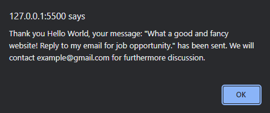

# Project 1

Create footer of the website that contains:

1. Social media links (minimum 3)
2. Description of the website
3. Phone number and address

Result:

    Screenshot for eNews footer
      
    

# Project 2

Create welcome page using Bootstrap that contains:

1. Header (have logo and navigation bar)
2. Welcome section (there is picture/background picture and words to attract users)

Result:

    Screenshot for eNews navigation bar
      
    

    Screenshot for eNews homepage
      
    

Create contact us section using Bootstrap that contains:

1. Have 4 forms

   - first name, type: text
   - last name, type:text
   - email, type: email
   - message, type: text area

   Result:

    

    Screenshot for eNews "contact us" form
      
    
    

2. Have submit button (if user clicked the button, alert with data that have been entered will appear on the screen).

   Result:

   

   Screenshot for alert message after a user with name "Hello World" submit the form
     
   
   

