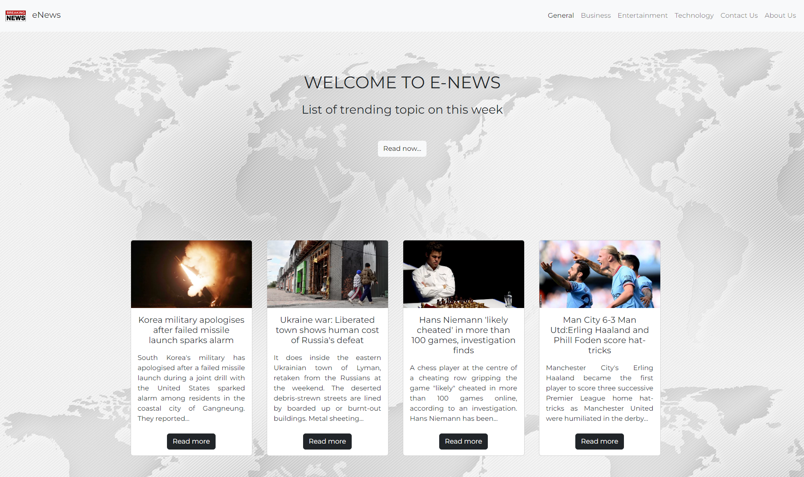
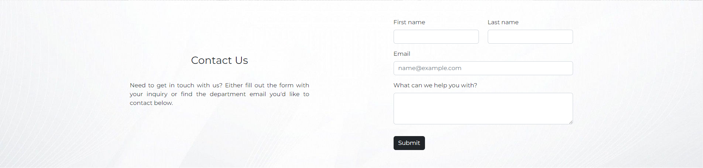
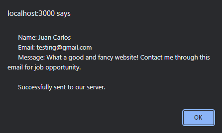
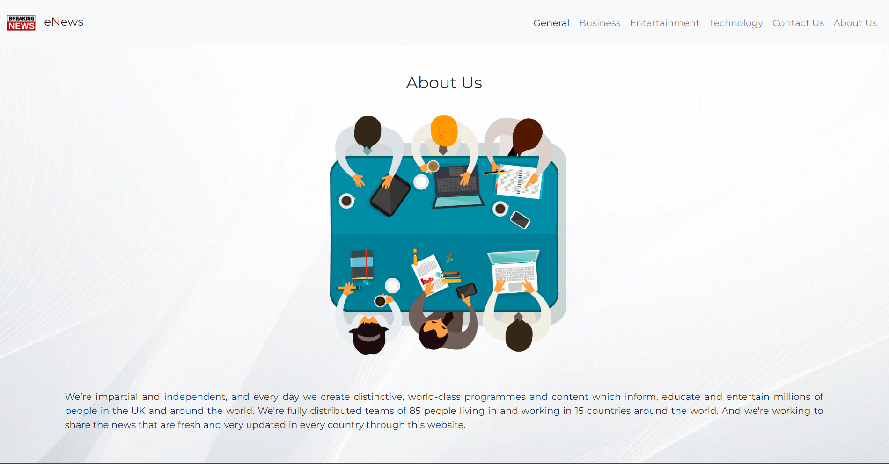
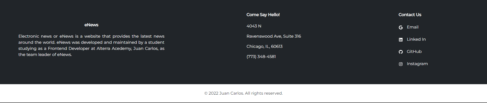

# Project

Change the project from weekly task 1 into React. The website that you've created using one page website method, so you don't need to apply React routing. You must apply the technology and libraries you are already familiar with.

Result:

    Welcome Page eNews:
      
    

    Contact Us eNews:
      
    

    Pop up alert after submit "Contact Us" form:
      
    

    About Us eNews:
      
    

    Footer eNews:
      
    

