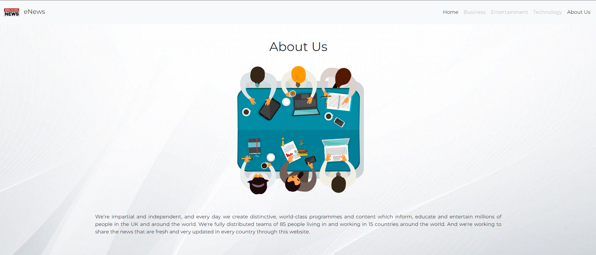
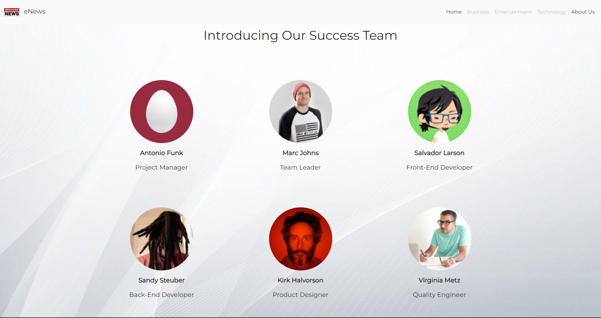
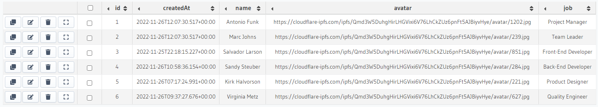

# Project

Still continuing weekly task 2 and adding some features. You are required to apply routing and dynamic routing on this project. Then, you are required to implement data fetching from hasura to your project. Create 'user' table in hasura and fetch the data to the 'About Us' page.

Result:

    About Us eNews:
      
    

    Fetching Data using Rest API:
      
    

    User's Table in Hasura:
      
    

